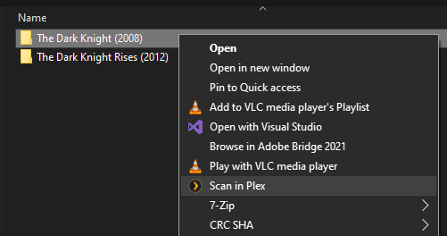

# Scan in Plex

The Scan in Plex script adds a 'Scan in Plex' context menu entry in Windows Explorer for folders that are part of your Plex library.

I don't like having automatic scanning enabled in Plex, but the only manual scan option available in the UI is to do a whole library scan. This can result in a lot of unnecessary scanning when I know the exact folder I want to add/rescan. [The command line](https://support.plex.tv/articles/201242707-plex-media-scanner-via-command-line/) can be used, but it's not very convenient. This project aims to make partial manual scanning easier by adding the ability to right click on any folder that's in your Plex library and immediately scan it.

## Requirements

Python 3 and the packages outlined in requirements.txt, which can be installed via `pip install -r requirements.txt`

## Usage

`python ScanInPlex.py -h | -c [-p HOST] [-t TOKEN] [-v | -q] | -s -d DIRECTORY | -u [-q]`

---

### Configuration (`-c`)

Only two arguments are required, `host` and `token`. They can be specified in the provided `config.yml` file, or passed in as command line arguments. Configuration is best run as administrator. It should still work without elevation, but will result in UAC and regedit prompts, as the registry's HKCR cluster must be edited to add context menu handlers.

Value | Command line | Description
---|---|---
host | `-p`, `--host` | The host of the Plex server. Defaults to http://localhost:32400
token | `-t`, `--token` | Your Plex token. See Plex's official documentation for [Finding an authentication token](https://support.plex.tv/articles/204059436-finding-an-authentication-token-x-plex-token/)
web | `-w`, `--web` | Attempt to use the Plex Web API instead of invoking Plex Media Scanner.exe. May help with scanning some libraries that for some reason or another the exe fails to update, but stores your Plex authentication token in plain text.
verbose | `-v`, `--verbose` | Show more details and asks for confirmation before continuing
quiet | `-q`, `--quiet` | Only show warnings and errors

---
### Scan (`-s`)

Scanning will be invoked automatically by the context menu handler after going through configuration, but can also be run manually if a directory is provided:

Value | Command line | Description
---|---|---
directory | `-d`, `--directory` | Directory to scan in Plex

---

### Uninstall (`-u`)

Uninstalls the script, i.e. deletes the registry keys and %LOCALAPPDATA% files. Like configuration, running the script as an administrator will avoid UAC and regedit dialogs.

Value | Command line | Description
---|---|---
quiet | `-q`, `--quiet` | Only show warnings and errors

---

## Implementation Details

This script has three main parts:
1. Query your Plex server to grab all your library sections and the folders mapped to those sections.
2. Create the necessary registry entries to [create the shortcut menu handlers](https://docs.microsoft.com/en-us/windows/win32/shell/context-menu-handlers).
3. Create a configuration file that ScanInPlex will reference to properly invoke `Plex Media Scanner.exe`.
